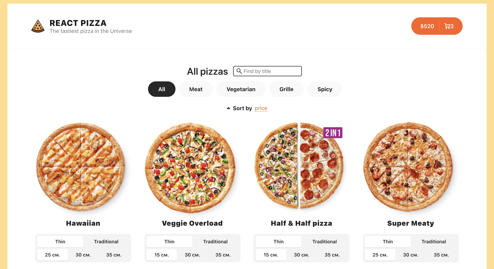

# Pizza-service 🍕   Full-stack application
If you want to test it on your own, here is link [https://pizza-service-5vz9.vercel.app/](https://pizza-service-5vz9.vercel.app/)

(Spring framework ⚙️ | ReactJS 💅)
 
 

### 🥸User can:
1. Add items to cart 🛒  
2. Configure items as he wants 

3. Filter items with search 
4. Filter items by categories 
5. Sort items by price/title/popularity 
6. Navigate through pages
7. `yarn start`  

### 📝 Used technologies:
* Frontend:
  - ⚛ ️ReactJS 18
  - TypeScript
  - Redux Toolkit (storing data / pizzas)
  - React Router v6 (navigation)
  - Redux Toolkit query (to communicate with api)
  - React Hooks (hooks)
  - Prettier (code formatting)
  - CSS-Modules / SCSS (styling)
  - React Content Loader (skeleton)
  - Lodash.Debounce
- Backend
  - 🌿Spring framework 3.0.0 (to handle requests)
  - MySQL (to store data)
  - Flyway 'Database migration'
  - Spring data JPA (to manage data)
- Global
  - git 
  - Docker
  - Amazon rds 
  - Can be deployed Amazon ecs
