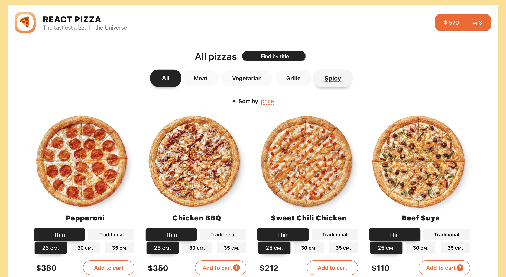

# Pizza-service 🕠  Full-stack application

(Spring framework ⚙️ | ReactJS 💅)
 
 

### To run the app:
1. `mvn spring-boot:run` 
2. `yarn start`  
3. Open [http://localhost:3000](http://localhost:3000) in the browser.

### 📝 Used technologies:
* Frontend:
  - ⚛ ️ReactJS 18
  - TypeScript
  - Redux Toolkit (storing data / pizzas)
  - React Router v6 (navigation)
  - Axios + Fetch (to send requests to database)
  - React Hooks (hooks)
  - Prettier (code formatting)
  - CSS-Modules / SCSS (styling)
  - React Content Loader (skeleton)
  - React Pagination (pagination)
  - Lodash.Debounce
  - Code Splitting, React Loadable, useWhyDidYouUpdate
- Backend
  - 🌿Spring framework 3.0.0
  - MySQL
  - Spring data JPA
  - Lombok

